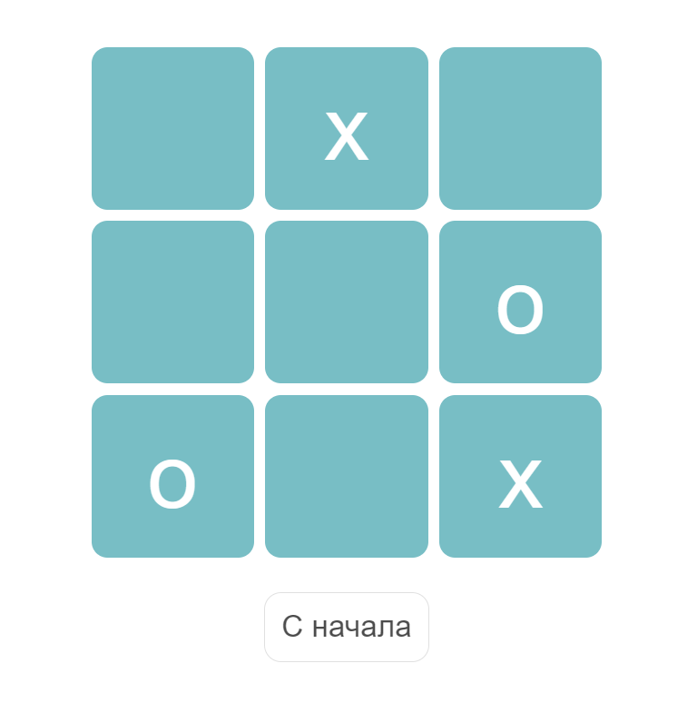

# ❌⭕ Tic-Tac-Toe

Простая браузерная реализация игры **Крестики-нолики** на чистом JavaScript.

## 🎮 Описание

Два игрока по очереди делают ходы, ставя `X` и `O` на игровое поле 3×3. Побеждает тот, кто первым соберёт три свои фигуры по вертикали, горизонтали или диагонали.

Игра автоматически определяет победителя и завершает партию после выигрыша.

## 🛠 Технологии

- **JavaScript** — игровая логика и отображение игрового поля
- **HTML/CSS** — стили разметка

## 🚀 Как это работает

### Основные компоненты:

- `players = ['x', 'o']` — список игроков
- `activePlayer` — текущий игрок (0 — крестик, 1 — нолик)
- `board` — игровое поле в виде массива 3×3
- `click(row, col)` — вызывается при клике по ячейке, записывает ход и проверяет победу

### Логика проверки победы:

- `checkVertical(col)` — победа по вертикали
- `checkHorizontal(row)` — победа по горизонтали
- `checkMainDiagonal(row, col)` — победа по главной диагонали
- `checkSecondaryDiagonal(row, col)` — победа по побочной диагонали

Если одна из проверок возвращает `true`, вызывается `showWinner(activePlayer)`.

## 📷 Скриншот

## 🔗 Ссылка

https://antonycoder.github.io/TicTacToe/